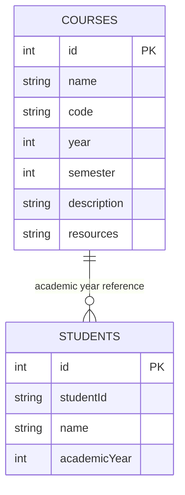

# Database Structure Diagram

## Table Details

### COURSES Table
| Column | Type | Constraints | Description |
|--------|------|-------------|-------------|
| id | INTEGER | PRIMARY KEY, AUTO_INCREMENT | Unique course identifier |
| name | TEXT | NOT NULL | Course name |
| code | TEXT | NOT NULL | Course code |
| year | INTEGER | NOT NULL | Academic year (1-4) |
| semester | INTEGER | NOT NULL | Semester (1-2) |
| description | TEXT | - | Course description |
| resources | TEXT | - | JSON string of resources |

### STUDENTS Table
| Column | Type | Constraints | Description |
|--------|------|-------------|-------------|
| id | INTEGER | PRIMARY KEY, AUTO_INCREMENT | Unique student identifier |
| studentId | TEXT | NOT NULL | Student ID |
| name | TEXT | NOT NULL | Student full name |
| academicYear | INTEGER | NOT NULL | Academic year (1-4) |

## Course Distribution

### First Year (Year 1)
- **Semester 1**: 6 courses
  - C Language (CLANG)
  - Internet of Things (IOT)
  - Communication (COMM1)
  - Vedic Math (VMATH)
  - Discrete Math (DMATH)
  - Human Value (HVALUE)

- **Semester 2**: 7 courses
  - Digital Design and Computer Architecture (DDCA)
  - Basic Electrical and Electronic Circuits (BEEC)
  - Data Structure (DS)
  - Linear Algebra (LINALG)
  - Communication (COMM2)
  - Indian Constitution (ICONST)
  - SIL (SIL)

### Second Year (Year 2)
- **Semester 1**: 9 courses
  - Database Management Systems (DBMS)
  - Computer Network (CN)
  - Front End (FE)
  - Object Oriented Programming using Java (OOPS)
  - Artificial Intelligence and Machine Learning (AIML)
  - Data Analytics (DA)
  - Processor and Controller (PC)
  - Mathematical Optimization (MO)
  - Japanese Language (JL)

- **Semester 2**: 2 courses
  - Operating System (OS)
  - Probability (PROB)